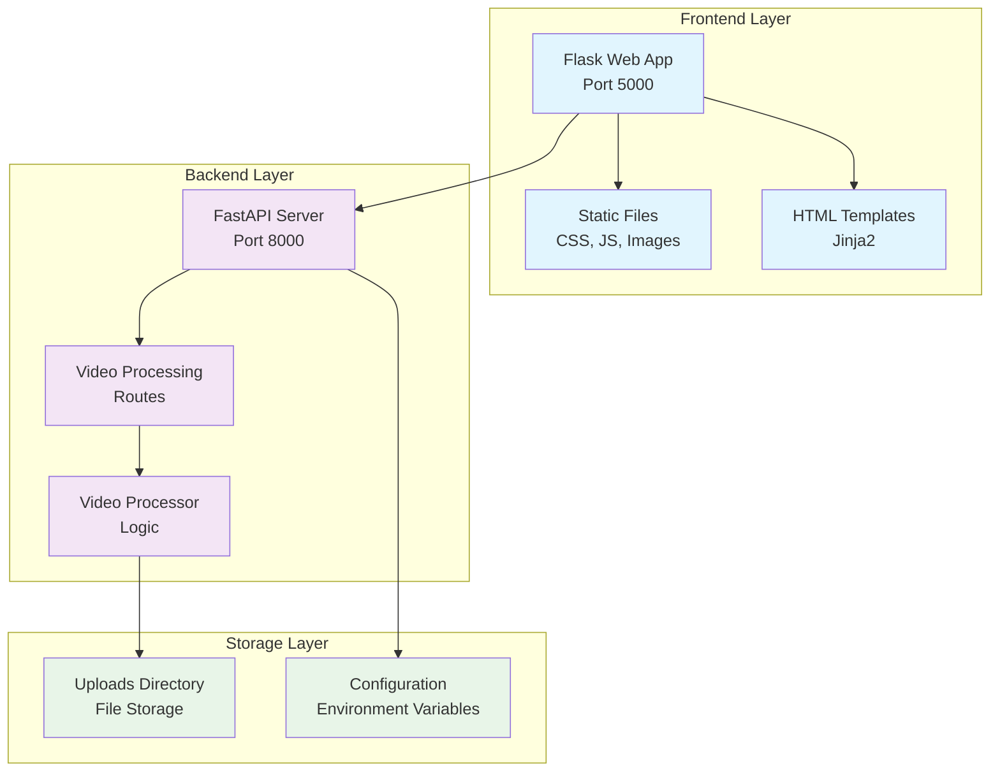
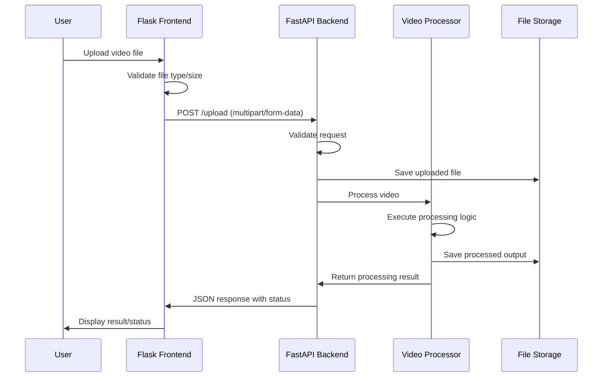
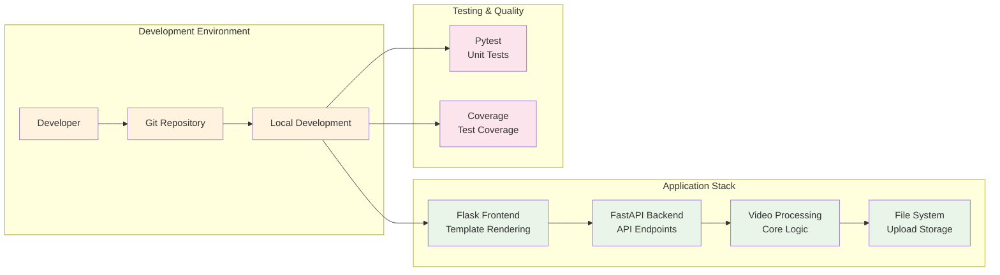

# Stepwise Video Processing Application

**Author:** Avish Shair  
**Version:** 1.0.0  
**License:** MIT  
**Architecture:** Modern web application with FastAPI backend and Flask frontend

A full-stack web application for processing videos with a modern FastAPI backend and Flask web interface, designed for efficient video upload, processing, and management with OpenCV-powered computer vision capabilities.

## 🚀 Features

- **Video Upload & Processing**: Seamless video file upload with OpenCV-powered processing
- **RESTful API**: Modern FastAPI backend with automatic OpenAPI documentation
- **Web Interface**: Responsive Flask-based frontend with intuitive UI
- **Computer Vision**: Advanced video processing using OpenCV library
- **File Validation**: Comprehensive file size and type validation
- **CORS Support**: Cross-origin resource sharing for frontend-backend communication
- **Environment Configuration**: Flexible configuration management
- **Health Monitoring**: Built-in health check endpoints
- **Containerized Deployment**: Docker support for easy deployment
- **High Performance**: Uvicorn ASGI server for optimal performance

## 🏗️ Architecture Overview



## 🛠️ Technology Stack

### Backend (API)
- **[FastAPI](https://fastapi.tiangolo.com/)** (v0.104.1) - Modern, fast web framework for building APIs
  - Automatic API documentation with Swagger UI
  - Built-in data validation with Pydantic
  - High performance with async/await support
  - Type hints for better code quality
- **[Uvicorn](https://www.uvicorn.org/)** (v0.24.0) - ASGI server for FastAPI
  - High-performance async server for Python web apps
  - Built on uvloop and httptools for maximum speed
  - WebSocket support and HTTP/2 compatibility
- **[Pydantic](https://pydantic-docs.helpmanual.io/)** (v2.5.0) - Data validation and settings management
  - Runtime data validation using Python type hints
  - JSON schema generation
  - Serialization and deserialization
- **[HTTPX](https://www.python-httpx.org/)** (v0.25.2) - Async HTTP client
  - Modern HTTP client for Python with async support
  - HTTP/2 and HTTP/3 support
  - Request/response interceptors
- **[Python-multipart](https://andrew-d.github.io/python-multipart/)** (v0.0.6) - Streaming multipart parser
  - Efficient handling of file uploads
  - Support for form-data parsing
- **[Requests](https://requests.readthedocs.io/)** (v2.28.0) - HTTP library for making requests
  - Simple and elegant HTTP requests
  - Session management and connection pooling
  - SSL certificate verification

### Web Interface
- **[Flask](https://flask.palletsprojects.com/)** (v3.0.0) - Web framework for the interface
  - Lightweight WSGI web application framework
  - Jinja2 templating engine
  - Built-in development server
- **[Werkzeug](https://werkzeug.palletsprojects.com/)** (v3.0.1) - WSGI utility library for Flask
  - HTTP request/response handling
  - URL routing and dispatching
  - Development server with debugging

### Core Processing
- **[OpenCV](https://opencv.org/)** (v4.8.0) - Computer vision library
  - Comprehensive video and image processing capabilities
  - Advanced computer vision algorithms
  - Real-time video processing and analysis
  - Frame extraction, filtering, and transformation

### Development & Deployment
- **[Docker](https://www.docker.com/)** - Containerization platform
  - Application containerization
  - Consistent deployment environments
  - Multi-stage builds for optimization

## 📋 Prerequisites

- **Python 3.8+** (recommended: Python 3.9+)
- **pip** (Python package manager)
- **Git** (for version control)

## 🏗️ Project Structure

```
stepwise/
├── 📁 static/                   # Frontend assets
│   ├── 🎨 css/                  # Stylesheets
│   ├── ⚡ js/                   # JavaScript files
│   └── 🖼️ images/              # Images and icons
├── 📁 templates/                # HTML templates (Jinja2)
├── 📁 uploads/                  # File storage directory
├── ⚙️ .env.example             # Environment variables template
├── 🌐 app.py                   # Flask frontend application
├── 📝 config.py                # Configuration management
├── 🚀 main.py                  # FastAPI backend server
├── 📦 requirements.txt         # Python dependencies
├── 🏃 run_both.py              # Multi-service launcher
├── 🛣️ video.py                 # Video processing routes
├── 🎬 video_processor.py       # Core video processing logic
└── 📖 README.md                # Project documentation
```

## 🔧 Installation

### 1. Clone the Repository
```bash
git clone <repository-url>
cd stepwise
```

### 2. Set Up Python Environment
```bash
# Create virtual environment
python -m venv venv

# Activate virtual environment
# On macOS/Linux:
source venv/bin/activate

# On Windows:
venv\Scripts\activate

# Install dependencies
pip install -r requirements.txt
```

### 3. Configure Environment Variables
```bash
# Copy example environment file
cp .env.example .env

# Edit configuration (see Configuration section below)
nano .env  # or use your preferred editor
```

## ⚡ Running the Application

### Application Flow



### Quick Start
```bash
# Start both services simultaneously
python run_both.py
```

### Manual Start (Development)
```bash
# Terminal 1 - Start FastAPI Backend
uvicorn main:app --host 0.0.0.0 --port 8000 --reload

# Terminal 2 - Start Flask Frontend
python app.py
```

### Access Points
- **Frontend Application**: http://localhost:5000
- **API Documentation**: http://localhost:8000/docs
- **Alternative API Docs**: http://localhost:8000/redoc
- **Health Check**: http://localhost:8000/health

## ⚙️ Configuration

### Environment Variables (.env)

```ini
# Application Settings
DEBUG=True                        # Enable debug mode
SECRET_KEY=your-secret-key-here   # Flask session secret

# File Upload Configuration
UPLOAD_FOLDER=uploads             # Upload directory path
MAX_CONTENT_LENGTH=104857600      # Max file size (100MB)
ALLOWED_EXTENSIONS=mp4,avi,mov,mkv,webm,flv,wmv

# CORS Configuration
ALLOWED_ORIGINS=http://localhost:3000,http://localhost:5000,http://127.0.0.1:5000

# API Configuration
API_HOST=0.0.0.0                  # API server host
API_PORT=8000                     # API server port
FRONTEND_HOST=127.0.0.1           # Frontend server host
FRONTEND_PORT=5000                # Frontend server port
```

### Supported Video Formats
- **MP4** (.mp4) - Recommended for web compatibility
- **AVI** (.avi) - Windows standard format
- **MOV** (.mov) - QuickTime format
- **MKV** (.mkv) - Matroska container format
- **WebM** (.webm) - Web-optimized format
- **FLV** (.flv) - Flash video format
- **WMV** (.wmv) - Windows Media format

## 🧪 Development

### System Architecture




### API Testing
```bash
# Test health endpoint
curl http://localhost:8000/health

# Test file upload (replace with actual file)
curl -X POST "http://localhost:8000/upload" \
  -H "Content-Type: multipart/form-data" \
  -F "file=@sample_video.mp4"
```

## 📚 Libraries & Dependencies

### Core Dependencies

| Library | Version | Purpose | Documentation |
|---------|---------|---------|---------------|
| **FastAPI** | v0.104.1 | Modern web framework for APIs | [Docs](https://fastapi.tiangolo.com/) |
| **Uvicorn** | v0.24.0 | ASGI server implementation | [Docs](https://www.uvicorn.org/) |
| **Pydantic** | v2.5.0 | Data validation and settings | [Docs](https://pydantic-docs.helpmanual.io/) |
| **Flask** | v3.0.0 | Web framework for interface | [Docs](https://flask.palletsprojects.com/) |
| **Werkzeug** | v3.0.1 | WSGI utility library | [Docs](https://werkzeug.palletsprojects.com/) |
| **OpenCV** | v4.8.0 | Computer vision and video processing | [Docs](https://opencv.org/) |

### HTTP & Communication

| Library | Version | Purpose | Documentation |
|---------|---------|---------|---------------|
| **HTTPX** | v0.25.2 | Async HTTP client | [Docs](https://www.python-httpx.org/) |
| **Requests** | v2.28.0 | HTTP library for making requests | [Docs](https://requests.readthedocs.io/) |


### Development Dependencies

| Library | Version | Purpose | Documentation |
|---------|---------|---------|---------------|
| **Python-dotenv** | ^1.0.0 | Environment variable loader | [Docs](https://github.com/theskumar/python-dotenv) |

### Optional Dependencies (Video Processing)

| Library | Purpose | Installation |
|---------|---------|-------------|
| **OpenCV** | Computer vision and video processing | `pip install opencv-python` |

## 🚀 Production Deployment

### Deployment Checklist

- [ ] Set `DEBUG=False` in production
- [ ] Use strong `SECRET_KEY`
- [ ] Configure proper CORS origins
- [ ] Set up HTTPS with SSL certificates
- [ ] Configure reverse proxy (Nginx/Apache)
- [ ] Set up process management (systemd/supervisor)
- [ ] Configure proper logging
- [ ] Set up monitoring and health checks
- [ ] Configure database (if needed)
- [ ] Set up backup strategy

### Production Server Setup

```bash
# Install production dependencies
pip install gunicorn flower

# Run API with Gunicorn
gunicorn -w 4 -k uvicorn.workers.UvicornWorker -b 0.0.0.0:8000 main:app

# Run Flask interface with Gunicorn  
gunicorn -w 4 -b 0.0.0.0:5000 app:app

# Start Celery worker
celery -A tasks worker --loglevel=info --concurrency=4

# Start Celery monitoring (Flower)
celery -A tasks flower --port=5555
```

### Docker Production Deployment

```yaml
# docker-compose.prod.yml
version: '3.8'
services:
  redis:
    image: redis:alpine
    restart: always
    
  api:
    build:
      context: .
      dockerfile: Dockerfile.api
    environment:
      - ENVIRONMENT=production
    depends_on:
      - redis
    restart: always
    
  interface:
    build:
      context: .
      dockerfile: Dockerfile.interface
    depends_on:
      - api
    restart: always
    
  celery:
    build:
      context: .
      dockerfile: Dockerfile.api
    command: celery -A tasks worker --loglevel=info
    depends_on:
      - redis
    restart: always
    
  nginx:
    image: nginx:alpine
    volumes:
      - ./nginx.conf:/etc/nginx/nginx.conf
    ports:
      - "80:80"
      - "443:443"
    depends_on:
      - api
      - interface
    restart: always
```

## 📊 Monitoring & Logging

### Health Check Endpoint

```bash
# Check application health
curl http://localhost:8000/health

# Expected response
{
  "status": "healthy",
  "timestamp": "2024-01-01T12:00:00Z",
  "version": "1.0.0"
}
```

### Logging Configuration

```python
# Add to your configuration
import logging

logging.basicConfig(
    level=logging.INFO,
    format='%(asctime)s - %(name)s - %(levelname)s - %(message)s',
    handlers=[
        logging.FileHandler('app.log'),
        logging.StreamHandler()
    ]
)
```

## 🤝 Contributing

1. Fork the repository
2. Create a feature branch (`git checkout -b feature/amazing-feature`)
3. Make your changes
4. Run tests and format code
5. Commit changes (`git commit -m 'Add amazing feature'`)
6. Push to branch (`git push origin feature/amazing-feature`)
7. Open a Pull Request

## 📝 License

This project is licensed under the MIT License - see the [LICENSE](LICENSE) file for details.

## 👨‍💻 Author

**Avish Shair**
- GitHub: [@avish-shair](https://github.com/AvishShair)
- Email: avishshair9614@gmail.com

## 🙏 Acknowledgments

- FastAPI team for the excellent framework
- Flask community for the robust web framework
- Python community for amazing ecosystem
- Contributors and testers

---

